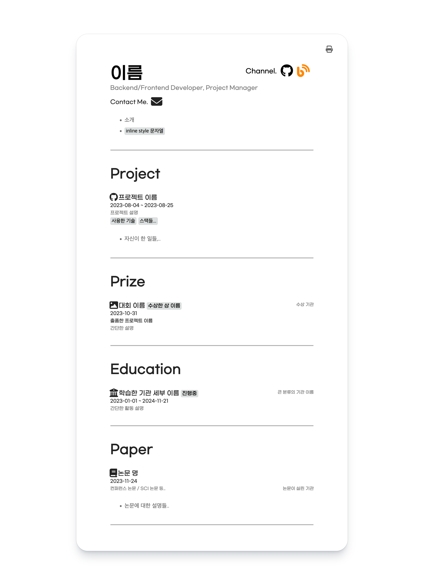
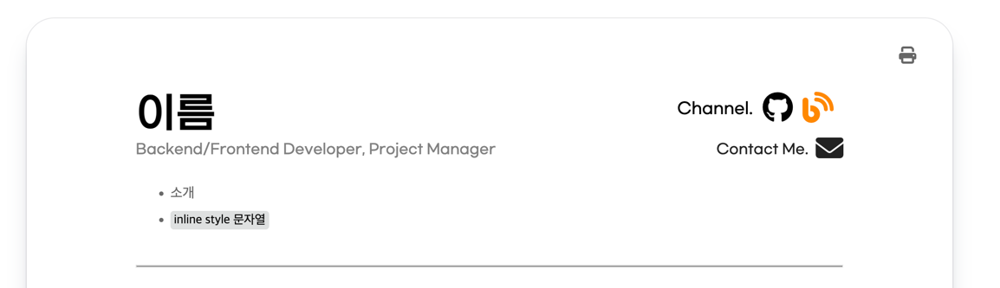
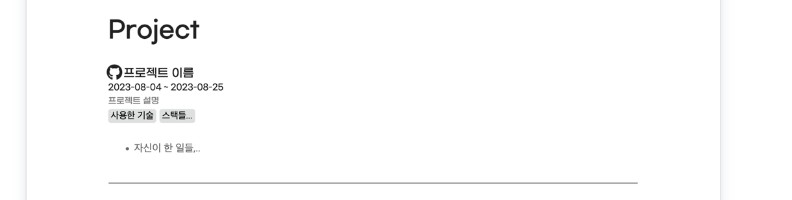
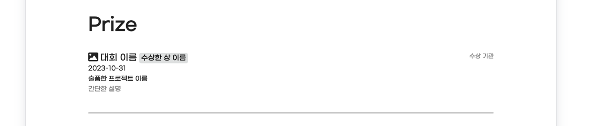
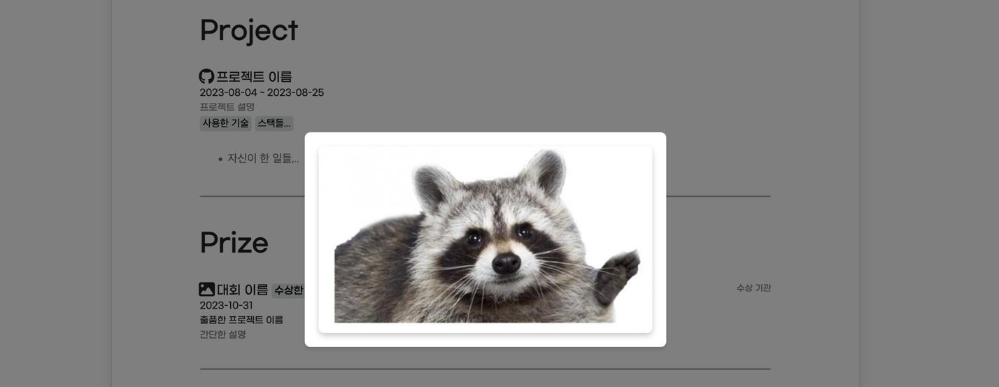
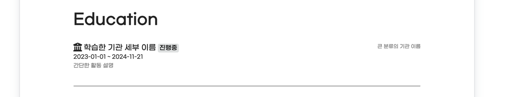
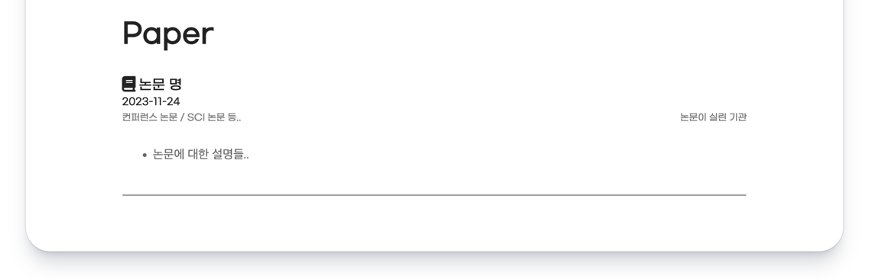

# Resume Project

## 프로젝트 소개
간단하게 resume를 만들 수 있는 프로젝트입니다.

### 사용 기술

<center>

</center>

- `Java 17`, `Spring Boot`, `Thymeleaf`

### Resume



### Resume Title

  
- 우측 상단의 채널은 Github과 Blog로 이동할 수 있다.
- 우측 상단의 메일 아이콘으로 메일 주소를 복사할 수 있다.
- 우측 상단의 프린트 아이콘으로 PDF로 다운로드할 수 있다.

### Resume Project


- 프로젝트 이름을 클릭하여 프로젝트의 Github으로 이동할 수 있다.

### Resume Prize



- 대회 이름을 클릭하여 수상한 상장이나 사진들을 모달을 통해 보여줄 수 있습니다.

### Resume Education


- 학습한 기관 이름을 클릭하여 보여줄 링크로 이동할 수 있다.

### Resume Paper


- 논문명을 클릭하여 논문 링크로 이동할 수 있다.


# 사용 방법
- 각 정보들 : `src/main/resource/data` 경로에 필요한 데이터를 json으로 작성한다.
- prize에서 사용할 이미지 : `src/main/resource/images` 경로에 필요한 이미지를 넣는다.   
- 각 정보들은 입력하지 않는다면, resume에 표시되지 않는다.

예시들은 아래와 같다.

### User 정보 추가
```json
{
  "name": "이름",
  "job" : "Backend/Frontend Developer, Project Manager",
  "githubLink": "github주소",
  "blogLink": "blog주소",
  "emailLink": "이메일",
  "introductions": [
    "소개",
    "<span class=\"inline-code\">inline style 문자열</span>"
  ]
}
```

### Project 정보 추가
```json
[
  {
    "name": "프로젝트 이름",
    "description": "프로젝트 설명",
    "start-date": "2023-08-04",
    "end-date": "2023-08-25",
    "tech-stacks": ["사용한 기술", "스택들..."],
    "works": [
      "자신이 한 일들,.."
    ],
    "github-link": "github 링크"
  },
  {
    "name": "프로젝트 이름",
    "description": "프로젝트 설명",
    "start-date": "2023-08-04",
    "end-date": "2023-08-25",
    "tech-stacks": ["사용한 기술", "스택들..."],
    "works": [
      "자신이 한 일들,.."
    ],
    "github-link": "github 링크"
  }
]
```

### Prize 정보 추가
```json
[
  {
    "name": "대회 이름",
    "projectName": "출품한 프로젝트 이름",
    "agency": "수상 기관",
    "prize": "수상한 상 이름",
    "date": "2023-10-31",
    "description": "간단한 설명",
    "imageUrl": "/img/prize.png"
  }
]
```
- 사용할 이미지는 `src/main/resource/images` 경로에 넣은 후 `/img/{파일명}`의 형식으로 입력해주세요
- 배포 환경에 따라 다르지만, 한글 이름을 가진 이미지는 빌드에 실패할 수 있습니다.


### Education 정보 추가
```json
[
  {
    "name": "학습한 기관 세부 이름",
    "startDate": "2023-01-01",
    "endDate": "2024-11-21",
    "description": "간단한 활동 설명",
    "agency": "큰 분류의 기관 이름",
    "evidenceUrl": "증거나 보여줄 링크",
    "isProgress": true
  }
]
```
- isProgress의 true false 여부에 따라 진행중, 수료 표시가 변경된다.

### Paper 정보 추가
```json
[
  {
    "name": "논문 명",
    "date": "2023-11-24",
    "descriptions": [
      "논문에 대한 설명들.."
    ],
    "paperUrl": "논문 링크",
    "institute": "논문이 실린 기관",
    "type": "컨퍼런스 논문 / SCI 논문 등.."
  }
]
```

### 추천 배포 방식
프로젝트를 fork하고 아래의 방식을 따라 배포한다.
- [배포 참고 링크](https://hojun-dev.tistory.com/entry/Spring-Boot-%EB%AC%B4%EB%A3%8C%EB%A1%9C-%EB%B0%B0%ED%8F%AC%ED%95%98%EA%B8%B0-Koyeb-GitHub)